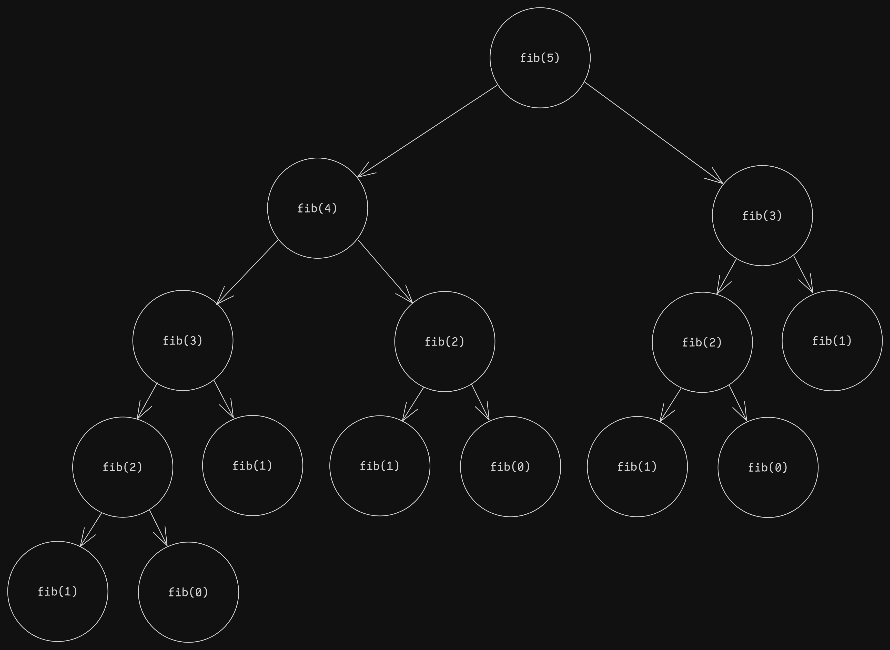
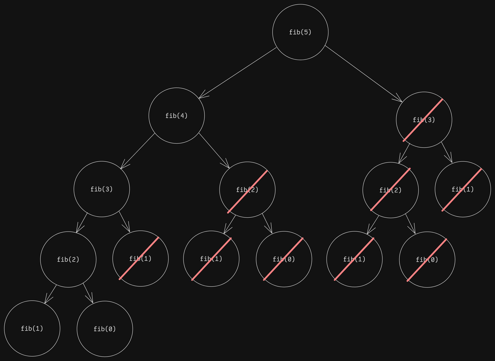

# Unit 0
## Prerequisites
- Read and understand C++ code
- Time complexity and Big O notation

## Introduction to Dynamic Programming
### What is Dynamic Programming?
**Dynamic Programming** (DP) is a problem-solving technique that can be used on problems that can be broken down into subproblems. More formally, we can apply dynamic programming when the *optimal substructure* and *overlapping substructure* properties hold true.

In layman terms, this means we can save time and space (a.k.a. memory) by reusing previous computations (recurrences). To further understand this, let's go through a worked example, Fibonacci.

### Worked Example: Fibonacci
Fibonacci is famous sequence that is built on a recursive formula, which allows for it to easily be optimized with DP:
```
F(0) = 1
F(1) = 1
F(i) = F(i-1) + F(i-2)
```

If we naively implement this via a recursive function, it results in a time complexity of O(2<sup>n</sup>), where n represents the nth Fibonacci number.
```c++
long long fib(int i) {
    if (i == 0 or i == 1) {
        return 1LL;
    } else {
        return fib(i - 1) + fib(i - 2);
    }
}
```

To better understand the time complexity, see the following diagram:



As you can see, each call to `fib` generates two more recursive calls to `fib`, save for `fib(1)` and `fib(0)`. For the example, `fib(5)`, we can see that the recursive calls form an almost complete binary tree. A complete binary tree has 2<sup>(n+1)</sup>-1 nodes. It becomes clear that this is the upper bound for the time complexity of this recursive implementation. In the proper Big O notation for time complexity, it would then be O(2<sup>n</sup>).

### Dynamic Programming as an Optimization
We can improve our implementation by using dynamic programming. There are generally two approaches to DP, *memoization* (top-down) and *tabulation* (bottom-up). The first utilizes recursion, while the second utilizes iteration. Iteration is typically faster than recursion, so it is preferred when possible.

Here's code that will generate up to the nth fibonacci number on every call. For each fibonacci number we calculate, store the value in a vector `memo` for future use. This will reduce the number of repeated calculations we need to do.

```c++
vector<long long> memo = {1LL, 1LL};

long long calc(int i) {
    if (memo[i] != -1LL) {
        return memo[i];
    }

    return memo[i] = calc(i - 1) + calc(i - 2);
}

long long fib(int mx) {
    if (mx < 2 || mx < memo.size())
        return calc(mx);
    int prevSize = memo.size();
    memo.resize(mx+1);
    fill(memo.begin() + prevSize, memo.end(), -1LL);
    return calc(mx);
}
```

A quick glance might not differentiate the two implementations immediately, but on closer inspection, the time and space complexity are evidently linear O(n). This is because instead of recalculating previously processed fibonacci numbers, we instead save it in `memo` and use it for further calculations.

See the following diagram for reference:



All calls to `fib` that are crossed out are calls that perform no calculations, but instead simply access the answer for that call that we've already saved, which reduces the time complexity of these calls to O(1). As seen in the diagram, we only need to compute the answer for n+1 calls (in reality, it's n-1 because `fib(0)` and `fib(1)` are base cases). In Big O notation, this comes out to O(n).

Note that if we all we require is the nth fibonacci number, then there exist further optimizations: *space optimization*, with time O(n), space O(1); and *matrix exponentation*, with time O(log(n)), space O(log(n)). See Resources below for more information.

### States and Transitions
A common way to think about dynamic programming is through the idea of *states* and *transitions*. A state is defined as the current state of a subproblem. In this case, it's the `i`-th fibonacci number. A transition is defined as the transition between two (or more) states, or more succinctly, the operation(s) that allow for a state to be calculated from other states. In this case, the `i`-th fibonacci number can be calculated from the `i-1` and `i-2` states.

## Moving Forward
### Prerequisites
The further units will tackle specific types of dynamic programming. These discuss methods to solve problems with similar patterns. Even so, it is advisable that one have a solid grasp of understanding and using dynamic programming before proceeding.

#### Resources:
- [GFG - Nth Fibonacci Number](https://www.geeksforgeeks.org/program-for-nth-fibonacci-number/)
- [CSES - Competitive Programmer's Handbook](https://cses.fi/book/book.pdf)
- [CSES - Problem Set](https://cses.fi/problemset/)
- [AtCoder - Educational DP Contest](https://atcoder.jp/contests/dp/tasks)